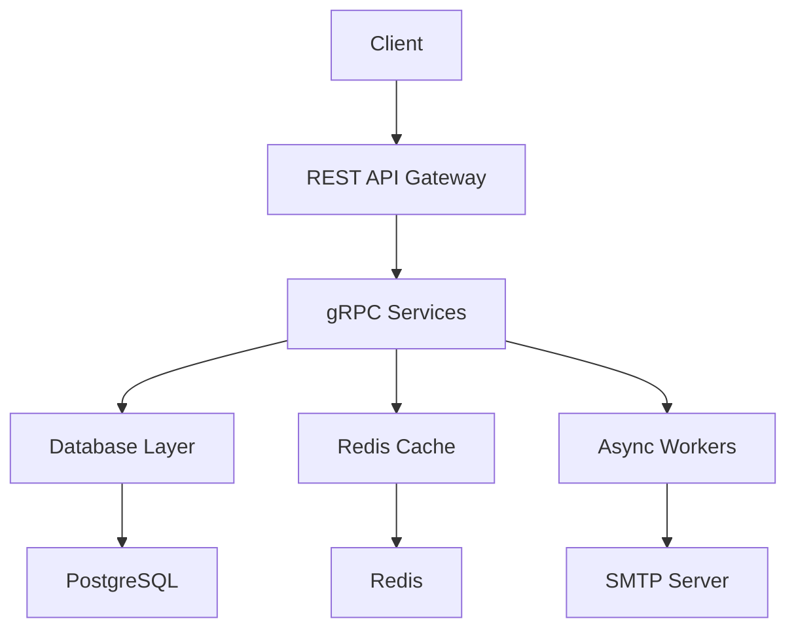

# System Architecture

## Components

## Key Layers
1. **API Gateway**: REST endpoints proxying to gRPC services ([Implementation Details](./RPC_IMPLEMENTATION.md))
2. **Core Services**: 
   - Authentication (JWT)
   - User/Product management
   - Email notifications
3. **Data Layer**:
   - PostgreSQL for persistent storage
   - Redis for caching and async task queue
4. **Infrastructure**:
   - Dockerized database services
   - Configuration management
   - Secret handling
