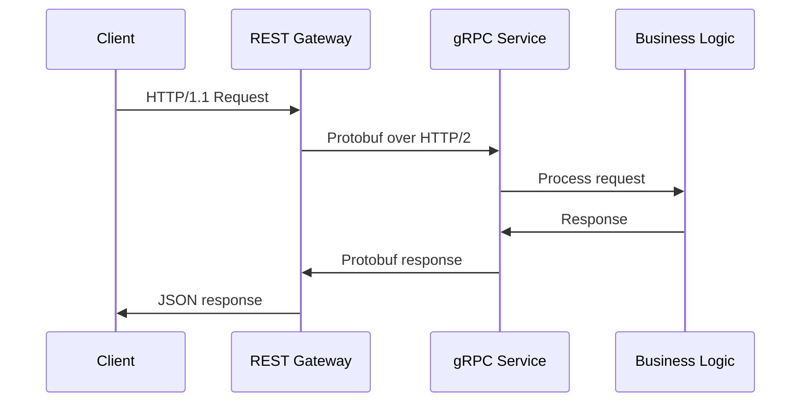

# RPC Implementation Guide

## Architecture Flow


## Key Components
1. **gRPC Services**
   - Defined in `.proto` files
   - Auto-generated code in `server/services/`
   - Implements core business logic

2. **REST Gateway**
   - Translation layer (HTTP-JSON ↔ gRPC-protobuf)
   - Configured in `cmd/cmd.go`
   - Routes mapped in `third_party/google/api/annotations.proto`

## Code Generation
```bash
# Regenerate gRPC and gateway code
make generate
```

## Implementation Patterns
- Use `grpc-gateway/v2` runtime for HTTP/gRPC translation
- Error handling via `server/repositories/errors`
- Middleware chain in REST gateway setup
